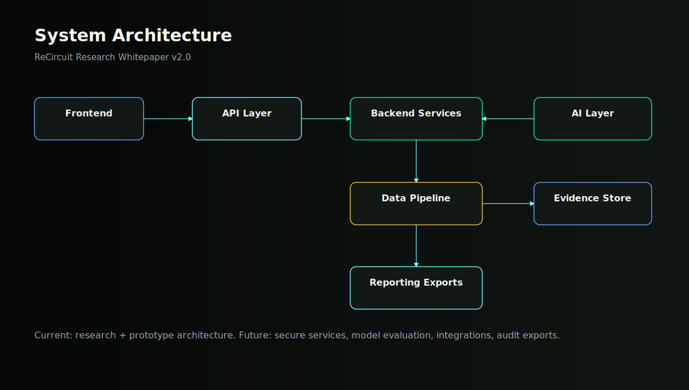
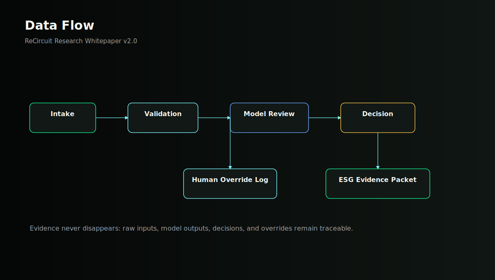
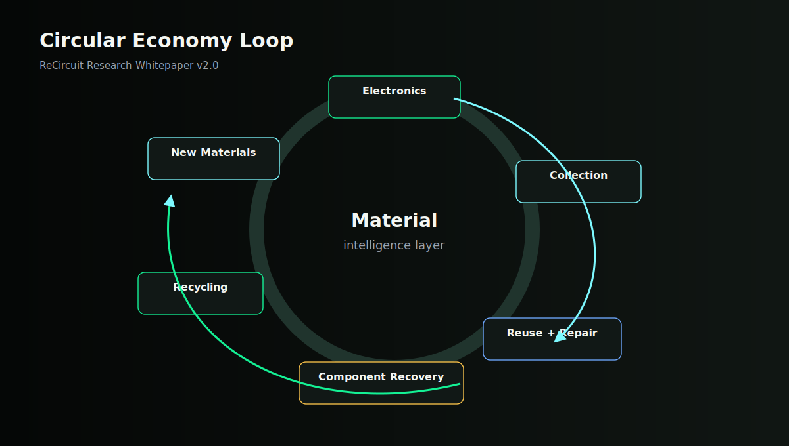
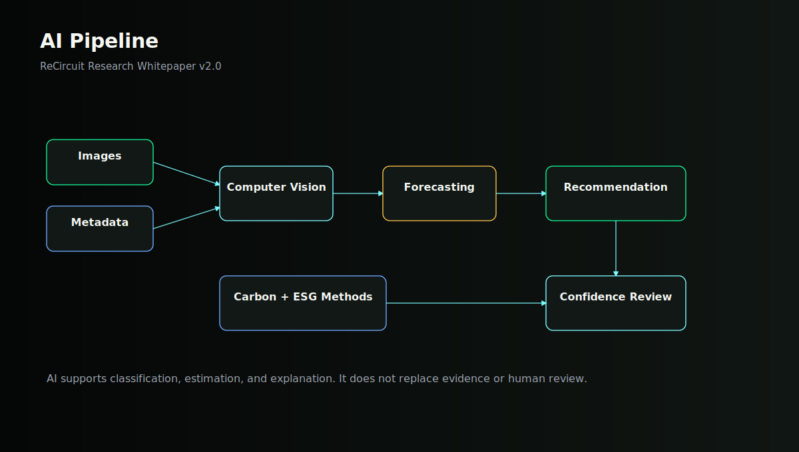
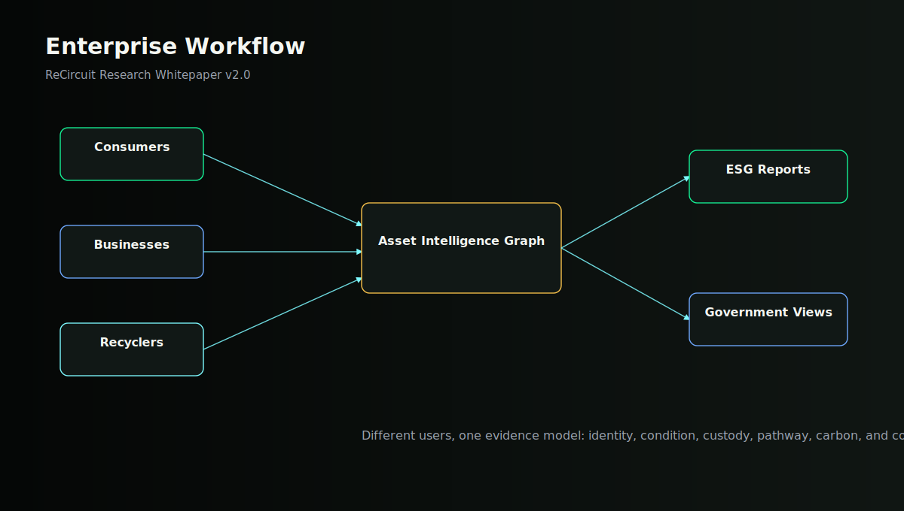

# ReCircuit Research Whitepaper

## Building the Intelligence Layer for the Circular Economy

**Author:** Mohnish M  
**Role:** Founder, ReCircuit  
**Version:** 2.0  
**Publication Date:** 2026  
**Status:** Research publication. ReCircuit is founder-led and early-stage; prototype work is in development.

## Abstract

Electronic waste is no longer only a disposal problem. It is a fragmented intelligence problem
across product identity, material value, reverse logistics, climate accounting, repairability,
and compliance evidence.

ReCircuit proposes an AI platform for material intelligence across the circular economy. The
platform vision combines structured device intake, computer vision, forecasting, pricing logic,
carbon estimation, ESG evidence, and API-accessible records so that recovery decisions can be
made with more context and less ambiguity.

This publication separates current status from future capability. ReCircuit has a public
website, research foundation, architecture direction, and prototype work in development. It does
not claim customers, revenue, funding, deployments, investors, employees, partnerships, awards,
or validated performance metrics.

## Executive Summary

### What problem exists?

The circular electronics system is data-poor at the moment decisions matter most. Devices enter
collection streams with weak identity, incomplete condition records, uncertain residual value,
limited chain-of-custody evidence, and inconsistent carbon accounting. Valuable assets are often
treated as generic waste because the decision infrastructure around them is fragmented.

### Why now?

The pressure is rising from three directions: e-waste generation is growing faster than
documented recycling, critical minerals are strategically important, and product-level
sustainability data is becoming more important under policy regimes such as the EU Ecodesign for
Sustainable Products Regulation and Digital Product Passport framework [1], [2], [4].

### Why AI?

AI can help interpret unstructured evidence at scale: images, serial labels, component photos,
repair notes, route constraints, market signals, and emissions factors. Its role is not to
replace certified processors or auditors; its role is to produce better decision support,
confidence scoring, exception handling, and traceable records.

### Why ReCircuit?

ReCircuit is focused on the missing intelligence layer between collection and recovery. The
proposed platform treats every device as a decision object with identity, condition, material,
carbon, compliance, and routing context. The goal is not another recycling directory; the goal
is infrastructure for smarter circular decisions.

### What is the vision?

ReCircuit aims to become a material intelligence platform that helps consumers, businesses,
recyclers, and governments choose higher-value circular pathways: repair, reuse, resale,
component harvesting, certified recycling, or secure destruction. The current work is research
and prototype development, not a deployed enterprise network.

## Original Diagrams

### System Architecture

Frontend, API, backend services, AI layer, data pipeline, evidence store, and reporting exports.

### Data Flow

Device evidence moves from intake through validation, models, decisioning, human review, and
reporting.

### Circular Economy Loop

Electronics flow through collection, triage, reuse, component recovery, recycling, and new
materials.

### AI Pipeline

Computer vision, forecasting, recommendation, carbon estimation, LLM assistance, and confidence
review.

### Enterprise Workflow

Consumers, businesses, recyclers, and governments interact with the same asset intelligence
graph.

## Global Context

_Electronic waste, critical minerals, circularity, reverse logistics, and product data are converging._

Global e-waste reached 62 billion kg in 2022, with only 22.3 percent documented as formally
collected and recycled in an environmentally sound manner. The same monitor projects 82 billion
kg of e-waste by 2030 under current trajectories [1]. These figures describe more than a waste
stream; they describe a global information failure around products, materials, accountability,
and recovery choices.

Critical minerals make the recovery problem strategically important. The International Energy
Agency identifies copper, lithium, nickel, cobalt, graphite, and rare earth elements as central
to clean energy supply chains and notes that market transparency, supply concentration, and ESG
risk are policy priorities [2]. Recycling and urban mining cannot remove the need for primary
mining, but they can create secondary supply, reduce waste, and improve resilience [3].

Circular economy theory emphasizes keeping products and materials in circulation at their
highest value through maintenance, reuse, refurbishment, remanufacture, and recycling [9].
Electronics recovery is difficult because product condition, component value, hazardous material
risk, repairability, data security, and market demand must be evaluated quickly and
consistently.

Policy is also moving toward product-level data. The European Commission describes the Digital
Product Passport as a digital identity card for products, components, and materials, intended to
support sustainability, circularity, and legal compliance [4]. ReCircuit's research direction
aligns with that shift: recovery systems need structured records that can move with products and
materials.

## Problem Statement

_Existing systems are fragmented across visibility, traceability, decision making, and compliance._

The end-of-life electronics ecosystem is not one system. It is a chain of partial systems:
consumer drop-off, corporate asset disposition, local collection, informal aggregation, repair
shops, refurbishers, data sanitization providers, logistics vendors, recyclers, smelters,
compliance teams, and auditors. Each node may know something important, but the evidence often
fails to travel.

Visibility is weak because device identity and condition are not consistently captured at
intake. Traceability is weak because the record of movement, custody, and processing is often
separated from the physical asset. Decision making is weak because repair, resale, parts
harvesting, recycling, and destruction are evaluated through local heuristics rather than a
shared intelligence layer.

Compliance is becoming harder because sustainability claims require evidence. The GHG Protocol
Scope 3 Standard provides a global methodology for value chain emissions accounting and
identifies upstream and downstream categories beyond a company's direct operations [5]. ISO
14064-1 specifies principles and requirements for organizational GHG quantification and
reporting [6]. Recovery platforms must therefore separate measured facts from estimates,
confidence from proof, and operational convenience from audit evidence.

**Current status**

- ReCircuit has a research position, public website, architecture direction, and prototype in
development.
- No customer deployments, certified processor integrations, audited emissions claims, or measured
recovery performance are claimed.

**Proposed future capabilities**

- Structured device intake with evidence capture.
- Recovery recommendation engine with uncertainty and override logging.
- ESG evidence packets aligned with chain-of-custody and emissions accounting needs.

## Platform Vision

_ReCircuit as an AI platform for material intelligence across the circular economy._

The ReCircuit platform vision is organized around a simple object: the recoverable asset. A
recoverable asset may be a phone, laptop, PCB, battery pack, accessory, server component, or
mixed electronic item. The platform does not treat the asset as anonymous waste. It builds a
structured record around identity, photos, condition, component signals, safety flags, ownership
context, location, market pathway, estimated emissions effect, and compliance evidence.

The intelligence layer then compares possible circular pathways: repair, reuse, resale,
refurbishment, component harvesting, certified recycling, or secure destruction. Each pathway
has a different economic, carbon, safety, data security, and compliance profile. ReCircuit's
proposed contribution is to make that comparison explicit.

The long-term platform is not a black-box sustainability score. It is a decision system with
inputs, outputs, assumptions, confidence levels, evidence requirements, and human review.

## Artificial Intelligence

_AI should improve decisions while exposing uncertainty._

Computer vision can classify device category, visible condition, corrosion, cracked glass,
missing components, battery swelling risk indicators, and component candidates. Forecasting can
estimate route demand, collection density, seasonal inflows, and market movement for recovered
parts. Recommendation systems can compare circular pathways using rules, model outputs, price
signals, and processor constraints.

Large language models can assist with document understanding, policy search, user guidance,
record summarization, and ESG narrative drafting, but they must not become the source of truth
for measured facts. In ReCircuit's design, LLM outputs are advisory and cite the underlying
asset record, policy source, or user-provided evidence.

Carbon estimation is treated as a model-backed estimate, not a proof claim. It can use device
category, weight, transport route, recovery pathway, emissions factors, and confidence intervals
to help compare options. Any public or customer-facing claim would require methodology review,
factor provenance, and audit-ready documentation.

**Current status**

- AI methods are architecture and prototype-stage concepts.
- No trained production computer vision model, audited emissions engine, or deployed
recommendation system is claimed.

**Proposed future capabilities**

- Image-based condition triage.
- Decision recommendations with confidence and human override.
- Carbon and ESG evidence generation with methodology notes.

## Enterprise Platform

_Different stakeholders need different workflows over the same asset intelligence graph._

Consumers need simple intake, pickup guidance, device preparation instructions, and trust
signals about where a device is going. Businesses need bulk upload, asset traceability, data
security evidence, reporting exports, and workflow approvals. Recyclers need operational triage,
batch planning, contamination and safety flags, route prioritization, and downstream records.
Governments need anonymized program visibility, policy metrics, compliance views, and
infrastructure planning.

ReCircuit's proposed enterprise platform is therefore multi-sided but not unfocused. The shared
primitive is the recoverable asset record. Each stakeholder sees a different surface over that
record: intake, operations, compliance, public program performance, or research analytics.

The platform should be designed for conservative claims. Dashboards must distinguish measured
data, modeled estimates, pending evidence, human overrides, and unavailable data. This is
especially important for ESG reporting, where weak evidence can create reputational and
regulatory risk.

## Business Model

_Revenue mechanisms should follow real workflow value, not speculative projection._

A realistic ReCircuit business model could combine software subscriptions, per-asset processing
fees, API usage, compliance report generation, analytics modules, and implementation services
for organizations with high electronics turnover. Government or campus programs could use
procurement or grant-supported pilots where the objective is infrastructure learning rather than
immediate enterprise sales.

The model should avoid dependency on unverified carbon credit revenue or inflated materials
arbitrage. Early revenue, if pursued, should be tied to measurable utility: intake automation,
operational prioritization, evidence generation, reporting time reduction, and improved recovery
routing.

**Current status**

- No revenue is claimed.
- No pricing has been validated with customers.

**Proposed future capabilities**

- Prototype-led discovery with recyclers, campus labs, businesses, and municipal programs.
- Pilot pricing based on workload, asset volume, and reporting complexity.

## Risks

_A credible circular AI platform must identify its own failure modes._

Technical risk includes poor image quality, dataset bias, device diversity, safety-critical
misclassification, weak materials estimation, and model drift. Financial risk includes long
enterprise sales cycles, low willingness to pay in waste operations, and high integration costs.
Regulatory risk includes changing definitions of sustainability claims, waste handling rules,
product passport requirements, and cross-border movement controls.

Execution risk is significant because ReCircuit is founder-led and early-stage. The platform
vision spans AI, logistics, compliance, climate accounting, and enterprise workflow design. That
scope must be sequenced carefully. Security risk includes sensitive asset information, serial
numbers, location data, business inventory, and potentially personal data on devices. AI
limitation risk includes hallucinated policy summaries, overconfident recommendations, and false
precision in emissions estimates.

The mitigation strategy is staged development: narrow prototype, transparent assumptions, human
review, source-linked records, conservative claims, security-by-design, and independent
validation before any public performance claim.

## About the Founder

_Founder biography, factual and non-resume style._

Mohnish M is the founder of ReCircuit and House of Mohny. He is a Computer Science Engineering
student building at the intersection of AI systems, product engineering, climate technology, and
circular economy infrastructure.

ReCircuit reflects a research-led founder thesis: the circular economy needs better intelligence
infrastructure before recovery systems can scale with trust. The current work focuses on public
research, product architecture, prototype development, and clear communication of what has and
has not been built.

## System Architecture

### Frontend

**Purpose:** User-facing portal for intake, dashboards, reports, research, and public communication.

**Inputs:** User forms, image uploads, asset metadata, organization context, workflow selections.

**Outputs:** Asset records, intake confirmations, dashboards, evidence views, downloadable reports.

**Current status:** Public website live. Research portal generated in v2.0. Product UI remains prototype-stage.

**Future work:** Role-based dashboard, upload experience, report preview, accessibility hardening, offline
collection mode.

### Backend

**Purpose:** Application services for asset records, workflow state, authorization, audit logging, and
integrations.

**Inputs:** Frontend requests, API calls, processor updates, model outputs, file metadata.

**Outputs:** Validated records, workflow events, audit logs, signed report artifacts, integration responses.

**Current status:** Architecture defined. No production backend deployment claimed.

**Future work:** Event-driven services, tenant model, RBAC, immutable audit trail, integration adapters.

### AI Layer

**Purpose:** Decision-support layer for classification, condition analysis, forecasting, recommendation, and
text assistance.

**Inputs:** Images, asset metadata, historical records, price signals, route data, policy references.

**Outputs:** Predictions, confidence scores, recommended pathway, explanation notes, exception flags.

**Current status:** Concept and prototype direction. No production model metrics claimed.

**Future work:** Dataset design, baseline models, human review loop, evaluation harness, model cards.

### Computer Vision

**Purpose:** Analyze device photos and component images for visible condition and category signals.

**Inputs:** Device images, component photos, labels, damage views, battery and PCB images.

**Outputs:** Category, condition flags, visible component hints, safety warnings, confidence score.

**Current status:** Research and prototype design.

**Future work:** Image capture protocol, labeled dataset, active learning, false-negative review for safety-
critical classes.

### Forecasting

**Purpose:** Forecast collection volume, route demand, downstream capacity, and market movement.

**Inputs:** Time series intake, geography, partner capacity, seasonality, price history.

**Outputs:** Demand forecasts, capacity warnings, pickup windows, planning signals.

**Current status:** Proposed future capability.

**Future work:** Synthetic planning model, pilot data capture, calibration against real operations.

### Pricing Engine

**Purpose:** Compare economic pathways for resale, repair, parts harvesting, recycling, or destruction.

**Inputs:** Asset category, condition, component signals, market data, processing costs, logistics costs.

**Outputs:** Pathway economics, value range, uncertainty, recommended handling route.

**Current status:** Architecture concept only.

**Future work:** Market source governance, price confidence bands, override logs, regional constraints.

### Carbon Intelligence

**Purpose:** Estimate emissions implications of alternative recovery pathways with visible assumptions.

**Inputs:** Asset weight, material class, route, recovery pathway, emissions factors, evidence quality.

**Outputs:** Estimated carbon impact, factor provenance, uncertainty band, methodology note.

**Current status:** Research-stage methodology.

**Future work:** Factor registry, methodology review, uncertainty scoring, audit export.

### ESG Engine

**Purpose:** Prepare evidence packets for Scope 3, diversion, chain-of-custody, and recovery reporting.

**Inputs:** Asset events, custody updates, processor records, carbon estimates, report templates.

**Outputs:** Evidence packet, status flags, report export, data gaps, confidence labels.

**Current status:** Report architecture defined. No audited reports claimed.

**Future work:** Report templates aligned to customer needs, assurance workflow, API export.

### API Layer

**Purpose:** Allow organizations and processors to exchange asset, workflow, and report data.

**Inputs:** External system requests, webhooks, batch imports, processor confirmations.

**Outputs:** Asset status, event updates, report data, integration notifications.

**Current status:** Future capability.

**Future work:** REST/GraphQL schema, webhooks, OAuth, rate limits, audit logging.

### Cloud Infrastructure

**Purpose:** Secure, scalable runtime for data storage, models, file handling, and observability.

**Inputs:** Application traffic, model jobs, uploaded files, logs, metrics.

**Outputs:** Available services, monitored jobs, secure storage, backups, deployment telemetry.

**Current status:** Not deployed as production infrastructure.

**Future work:** IaC, secrets management, encrypted storage, monitoring, cost controls.

### Data Pipeline

**Purpose:** Move asset evidence from intake through model processing, decisioning, reporting, and analytics.

**Inputs:** Raw uploads, validation events, model outputs, human decisions, downstream confirmations.

**Outputs:** Curated records, feature tables, event log, analytics views, exportable evidence.

**Current status:** Architecture complete at concept level.

**Future work:** Schema registry, validation rules, event bus, lineage tracking, data retention policy.

## Enterprise Workflows

### Consumers

Upload device details, receive preparation guidance, schedule or locate recovery path, track
handoff status.

**Value:** Lower friction, clearer trust, better preparation before collection.

### Businesses

Bulk asset intake, policy-based routing, data security evidence, Scope 3 and diversion exports.

**Value:** Better reporting workflow and defensible evidence for electronics disposition.

### Recyclers

Triage incoming items, flag safety issues, prioritize higher-value recovery, confirm processing
events.

**Value:** Operational visibility and more consistent handling decisions.

### Governments

View anonymized program metrics, infrastructure gaps, collection trends, and compliance
evidence.

**Value:** Better planning for circular economy programs and public recovery infrastructure.

## Roadmap

- **Q3 2026 - Research:** Publish Whitepaper v2.0, finalize prototype architecture, define dataset and evidence schema.
- **Q4 2026 - Prototype:** Build interactive intake flow, synthetic decision engine, diagrammed report generation, and
model evaluation plan.
- **Q1 2027 - MVP:** Release controlled MVP with asset record creation, manual review, carbon estimate placeholder,
and downloadable evidence packet.
- **Q2 2027 - Pilot:** Invite campus labs, local recyclers, and collection operators for narrow pilots with explicit
success criteria.
- **2028 - Enterprise:** Expand integrations, role-based dashboards, compliance workflows, and processor-facing API
surfaces.
- **2030 - Global platform:** Long-term vision: connect material traceability, recovery decisions, product data, and climate
intelligence at scale.

## Risk Register

- **Technical:** Model errors, device diversity, image quality, sparse data, and unsafe routing recommendations. Mitigation: Human review, confidence thresholds, narrow pilot scope, model cards, and safety-critical
escalation rules.
- **Financial:** Circular operations may have limited software budgets and long buying cycles. Mitigation: Focus on measurable workflow value and low-friction pilot design.
- **Regulatory:** Waste handling, product passport, data protection, and ESG claim rules may change. Mitigation: Source-linked policy monitoring and conservative claims.
- **Security:** Asset data, serials, locations, and business inventories can be sensitive. Mitigation: RBAC, encryption, audit logs, least-privilege APIs, and retention controls.
- **Market adoption:** Stakeholders may resist new workflows if benefits are unclear. Mitigation: Design around existing operations and prove value in narrow workflows.
- **AI limitations:** Overconfident or hallucinated outputs can weaken trust. Mitigation: Treat AI as decision support, require source evidence, and expose uncertainty.

## Appendices

### Glossary

- **Recoverable asset:** A device, component, material stream, or batch that may be repaired, reused, harvested,
recycled, or securely destroyed.
- **Material intelligence:** Structured knowledge about product identity, condition, components, value, carbon impact,
custody, and recovery pathway.
- **Digital Product Passport:** A digital identity record for products, components, and materials intended to support
sustainability, circularity, and compliance.
- **Decision intelligence:** A system that turns data, rules, predictions, constraints, and human judgment into explainable
operational decisions.
- **ESG evidence packet:** A structured export containing facts, estimates, custody events, methodology notes, and data
gaps behind a sustainability report.

### Future Research

- How can image capture protocols improve reliability for device and component classification?
- Which evidence fields are necessary for credible electronics Scope 3 and diversion reporting?
- How should confidence intervals be represented in recovery recommendations?
- What minimum data model can support product passport, processor, and corporate reporting use
cases without overburdening operators?
- How can circular routing optimize for value, emissions, safety, and local infrastructure
constraints simultaneously?

## References

[1] ITU and UNITAR, "The Global E-waste Monitor 2024," 2024. [Online]. Available: https://www.itu.int/en/ITU-D/Environment/Pages/Publications/The-Global-E-waste-Monitor-2024.aspx

[2] International Energy Agency, "Global Critical Minerals Outlook 2025," 2025. [Online]. Available: https://www.iea.org/reports/global-critical-minerals-outlook-2025

[3] International Energy Agency, "Recycling of Critical Minerals: Strategies to Scale Up Recycling and Urban Mining," 2024. [Online]. Available: https://www.iea.org/reports/recycling-of-critical-minerals

[4] European Commission, "Ecodesign for Sustainable Products Regulation," 2026. [Online]. Available: https://environment.ec.europa.eu/strategy/circular-economy/ecodesign-sustainable-products-regulation_en

[5] Greenhouse Gas Protocol, "Corporate Value Chain (Scope 3) Accounting and Reporting Standard," 2011. [Online]. Available: https://ghgprotocol.org/corporate-value-chain-scope-3-standard

[6] International Organization for Standardization, "ISO 14064-1:2018 Greenhouse gases - Part 1," 2018. [Online]. Available: https://www.iso.org/standard/66453.html

[7] National Institute of Standards and Technology, "AI Risk Management Framework," 2026. [Online]. Available: https://www.nist.gov/itl/ai-risk-management-framework

[8] International Energy Agency, "The Role of Traceability in Critical Mineral Supply Chains," 2025. [Online]. Available: https://www.iea.org/reports/the-role-of-traceability-in-critical-mineral-supply-chains

[9] Ellen MacArthur Foundation, "Circular economy introduction," 2026. [Online]. Available: https://www.ellenmacarthurfoundation.org/topics/circular-economy-introduction/overview
